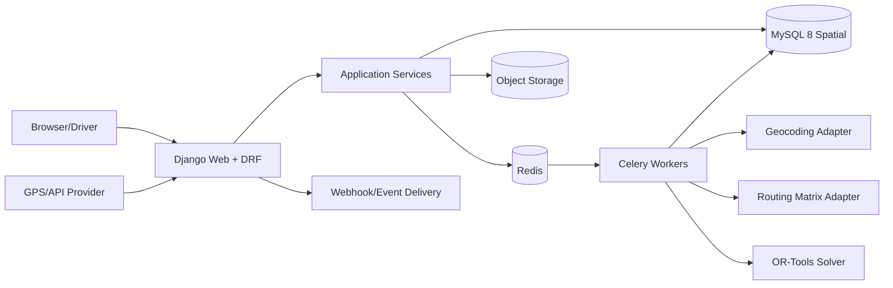

# Product Requirements Document
## Project #6 — Logistics Route Optimization

**Status:** Draft siap implementasi  
**Framework utama:** Django + GeoDjango  
**Frontend:** Django Jinja2 backend + Tailwind CSS + Alpine.js/HTMX  
**Database:** MySQL 8 Spatial  
**Optimization engine:** Google OR-Tools  
**Routing matrix:** OSRM, GraphHopper, HERE, Mapbox, atau provider adapter  
**Asynchronous processing:** Celery + Redis  
**Target pengguna:** Dispatcher, Fleet Manager, Driver, Operations Manager, Customer Service, dan Admin

> Catatan arsitektur: GeoDjango memiliki dukungan spatial untuk MySQL, tetapi cakupan fitur GIS MySQL berbeda dari PostGIS. PRD ini tetap menggunakan MySQL 8 Spatial sesuai requirement. Query geospasial lanjutan dan route calculation diisolasi pada adapter/repository agar migrasi ke PostGIS tetap mudah bila kebutuhan berkembang.

---

## 1. Ringkasan Produk

Logistics Route Optimization adalah aplikasi untuk mengelola depot, kendaraan, driver, order pengiriman, pickup/drop-off stop, time window, kapasitas, geofence, perencanaan rute, dispatch, monitoring progres, proof of delivery, exception, dan analitik operasional.

Django dipilih karena domain memiliki banyak relasi, role, workflow, back-office, dan kebutuhan GIS. GeoDjango digunakan untuk model spasial dan query dasar, sedangkan perhitungan jarak jalan dan optimasi rute menggunakan provider routing serta OR-Tools.

### 1.1 Nilai utama

- Mengurangi jarak dan waktu tempuh.
- Mengurangi keterlambatan.
- Menyeimbangkan beban kendaraan.
- Mempercepat proses dispatch.
- Memberikan visibilitas status order.
- Menangani constraint operasional secara eksplisit.
- Menyimpan histori rencana dan perubahan untuk audit.

### 1.2 Prinsip produk

1. **Operational correctness:** constraint lebih penting daripada sekadar jarak terpendek.
2. **Explainable plan:** dispatcher dapat melihat alasan order tidak teralokasi.
3. **Human override:** dispatcher dapat mengubah rute dengan validasi.
4. **Asynchronous optimization:** solver berjalan di worker.
5. **Provider abstraction:** map, geocoding, routing, dan traffic dapat diganti.
6. **Geospatial integrity:** koordinat, SRID, dan unit selalu eksplisit.
7. **Event-driven execution:** status order dan stop menghasilkan event yang dapat diaudit.

---

## 2. Tujuan dan Non-Tujuan

### 2.1 Tujuan MVP

- Multi-depot.
- Vehicle dan driver management.
- Customer/address management.
- Order pickup/delivery.
- Geocoding dan address validation.
- Time window.
- Service duration.
- Weight/volume/package capacity.
- Vehicle skill dan order requirement.
- Route plan manual dan optimized.
- Distance/time matrix.
- Vehicle Routing Problem dengan constraints.
- Map visualization.
- Dispatch route ke driver.
- Driver web/mobile responsive view.
- Stop status: arrived, completed, failed, skipped.
- Proof of delivery: photo, signature metadata, note.
- Live location ingestion opsional bertahap.
- Exception management.
- Dashboard dan report.
- Django Admin untuk master/back-office.
- API dan webhook.

### 2.2 Non-Tujuan MVP

- Full telematics hardware platform.
- Autonomous dispatch tanpa kontrol manusia.
- Turn-by-turn navigation engine sendiri.
- Marketplace driver.
- Warehouse management lengkap.
- International customs.
- Predictive maintenance.
- Dynamic pricing.

---

## 3. Persona dan Role

| Role | Kebutuhan | Hak |
|---|---|---|
| Organization Admin | Konfigurasi tenant | Semua |
| Operations Manager | KPI dan kebijakan | Semua operasi, report |
| Dispatcher | Membuat dan dispatch route | Order, route, driver |
| Fleet Manager | Kendaraan dan maintenance | Vehicle, availability |
| Driver | Menjalankan route | Route sendiri dan POD |
| Customer Service | Melihat order | Read, exception note |
| Auditor | Compliance | Read-only audit |

### 3.1 Permission

- `orders.view_order`
- `orders.create_order`
- `orders.change_order`
- `orders.cancel_order`
- `routes.create_plan`
- `routes.optimize_plan`
- `routes.dispatch_plan`
- `routes.override_plan`
- `fleet.manage_vehicle`
- `drivers.manage_driver`
- `tracking.view_live`
- `pod.verify`
- `reports.view_report`
- `settings.manage`
- `audit.view`

Object scope:
- Driver hanya route yang ditugaskan.
- Dispatcher dapat dibatasi per depot/region.
- Customer service tidak melihat cost internal.
- Fleet manager tidak dapat mengubah order.

---

## 4. Domain dan Workflow

### 4.1 Status order

```text
DRAFT
→ READY
→ PLANNED
→ DISPATCHED
→ IN_PROGRESS
→ COMPLETED

Alternative:
CANCELLED
FAILED
PARTIALLY_COMPLETED
UNASSIGNED
```

### 4.2 Status route plan

```text
DRAFT
→ MATRIX_PENDING
→ OPTIMIZING
→ OPTIMIZED
→ REVIEW
→ DISPATCHED
→ IN_PROGRESS
→ COMPLETED

Alternative:
FAILED
CANCELLED
SUPERSEDED
```

### 4.3 Status stop

```text
PENDING
→ EN_ROUTE
→ ARRIVED
→ SERVICING
→ COMPLETED

Alternative:
FAILED
SKIPPED
CANCELLED
```

### 4.4 Jenis constraint

Hard constraint:
- vehicle capacity;
- time window;
- depot start/end;
- driver availability;
- vehicle availability;
- skill requirement;
- maximum route duration;
- pickup before delivery;
- order precedence;
- restricted zone;
- maximum stops.

Soft constraint:
- preferred driver;
- balanced workload;
- minimize late arrival;
- minimize distance;
- minimize number of vehicles;
- preferred delivery period;
- avoid toll;
- route familiarity.

### 4.5 Objective function

Contoh weighted objective:

```text
Minimize:
  distance_cost
+ duration_cost
+ vehicle_fixed_cost
+ lateness_penalty
+ unassigned_penalty
+ overtime_penalty
+ workload_imbalance_penalty
+ route_change_penalty
```

Weight dapat dikonfigurasi per organization atau planning profile.

---

## 5. User Journey Utama

### 5.1 Import order

1. Dispatcher upload CSV atau memakai API.
2. Sistem validasi data.
3. Address dinormalisasi.
4. Geocoding dilakukan.
5. Order invalid masuk correction queue.
6. Order valid berstatus READY.
7. Duplicate external reference ditolak atau di-idempotent.

### 5.2 Membuat route plan

1. Dispatcher memilih tanggal, depot, shift, dan planning profile.
2. Sistem menampilkan eligible orders, vehicles, dan drivers.
3. Dispatcher meninjau data readiness.
4. Klik Optimize.
5. Worker membuat distance/time matrix.
6. Solver menjalankan optimization.
7. Result menyimpan routes, unassigned orders, violations, dan metrics.
8. Dispatcher meninjau map dan timeline.
9. Dispatcher melakukan manual adjustment bila perlu.
10. Sistem revalidate.
11. Route di-dispatch.

### 5.3 Driver execution

1. Driver login dari ponsel.
2. Melihat route hari ini.
3. Memulai route.
4. Membuka stop berikutnya.
5. Klik navigate untuk membuka provider navigasi.
6. Mark arrived.
7. Mengisi POD.
8. Mark completed atau failed.
9. Lokasi/status dikirim ke server.
10. Dispatcher melihat progres.

### 5.4 Exception

Contoh:
- customer unavailable;
- address invalid;
- vehicle breakdown;
- late arrival;
- failed delivery;
- damaged package;
- route deviation.

Flow:
1. Event dibuat.
2. Dispatcher menerima alert.
3. Dispatcher memilih resolve, reschedule, reassign, atau cancel.
4. Perubahan route menghasilkan version baru.
5. Driver menerima update.

---

## 6. Information Architecture

### 6.1 Navigasi utama

- Operations Dashboard
- Orders
- Planning
- Routes
- Live Map
- Drivers
- Vehicles
- Depots
- Exceptions
- Reports
- Integrations
- Settings

### 6.2 Struktur halaman

```text
/app
├── dashboard
├── orders
│   ├── list
│   ├── import
│   └── detail/:id
├── planning
│   ├── new
│   ├── optimization/:id
│   └── review/:id
├── routes
│   ├── list
│   └── detail/:id
├── live-map
├── drivers
├── vehicles
├── depots
├── exceptions
├── reports
├── integrations
└── settings
    ├── planning-profiles
    ├── geocoding
    ├── routing
    ├── notifications
    └── security
```

Driver view:

```text
/driver
├── today
├── route/:id
├── stop/:id
├── pod/:id
└── history
```

---

## 7. Draft Design UI Modern

### 7.1 Arah visual

- Gaya: operational command center.
- Peta menjadi elemen utama, tetapi data list/timeline tetap setara.
- Warna status konsisten.
- Layout desktop split panel.
- Driver UI mobile-first dengan tombol besar.
- Komponen padat tetapi tetap terbaca.
- Hindari informasi kritis hanya melalui warna.

### 7.2 Token desain

```text
Background       : slate-50
Surface          : white
Text primary     : slate-900
Text secondary   : slate-600
Border           : slate-200
Primary          : blue-600
Success          : emerald-600
Warning          : amber-500
Danger           : rose-600
Info             : cyan-600
Route accent     : generated from accessible palette
```

### 7.3 Komponen inti

- Map canvas.
- Map legend.
- Route polyline.
- Stop marker.
- Depot marker.
- Vehicle marker.
- Planning toolbar.
- Order table.
- Constraint badge.
- Optimization status stepper.
- Route timeline.
- Route summary card.
- Unassigned order panel.
- Violation panel.
- Driver status card.
- POD uploader.
- Exception drawer.
- Bulk import wizard.
- Geocode correction map.
- Compare plan panel.
- KPI card.

### 7.4 Operations Dashboard

KPI:
- Orders today.
- Planned.
- Unassigned.
- In progress.
- Completed.
- Failed.
- On-time percentage.
- Total planned distance.
- Vehicle utilization.

Panel:
- Live operational map.
- Route progress.
- Exceptions.
- Orders at risk.
- Driver status.
- Planning queue.

### 7.5 Orders List

Toolbar:
- date;
- depot;
- status;
- customer;
- geocode status;
- priority;
- time window;
- requirement;
- import;
- create;
- bulk action.

Kolom:
- reference;
- customer;
- address;
- time window;
- demand;
- priority;
- status;
- route;
- ETA;
- issue.

### 7.6 Planning Workspace

Desktop split:

```text
┌──────────────────────────────┬─────────────────────────────┐
│ Orders/Vehicles/Constraints  │ Map                         │
│ tabs and filters             │ routes and markers          │
├──────────────────────────────┼─────────────────────────────┤
│ Optimization summary         │ Route timeline/detail       │
└──────────────────────────────┴─────────────────────────────┘
```

Topbar:
- planning date;
- depot;
- profile;
- optimize;
- compare;
- validate;
- dispatch.

Optimization result:
- objective score;
- total distance;
- duration;
- vehicles used;
- unassigned count;
- late stops;
- compute time;
- solver status.

### 7.7 Manual Adjustment

- Drag stop dalam route.
- Move stop ke route lain.
- Lock stop/route.
- Add break.
- Change vehicle/driver.
- Recalculate affected route.
- Validate constraint.
- Warning modal untuk violation.
- Simpan sebagai new plan version.

### 7.8 Live Map

- Vehicle marker dengan status.
- Route progress.
- Next stop.
- ETA.
- Delay.
- Last GPS update.
- Filter depot/driver/status.
- Auto-refresh.
- Stale location indicator.
- Exception overlay.

### 7.9 Driver UI

Mobile-first:
- Route summary.
- Start route.
- Large next-stop card.
- Customer/address/time window.
- Call customer.
- Open navigation.
- Arrived.
- Complete/failed.
- Photo/signature/note.
- Offline queue indicator.
- Sync button.
- Emergency/contact dispatcher.

### 7.10 Accessibility

- Map memiliki list alternative.
- Marker memiliki accessible label.
- Route warna juga dibedakan pola/label.
- Action driver minimum touch target 44 px.
- Keyboard access untuk planning list.
- Drag operation memiliki menu fallback.
- Alert memakai `aria-live`.

---

## 8. Arsitektur Frontend Jinja2 + Tailwind

### 8.1 Template engine

Seperti Project #5, Django memakai:
- Jinja2 backend untuk aplikasi utama.
- DjangoTemplates untuk Django Admin.

### 8.2 Teknologi

- Jinja2.
- Tailwind CSS.
- Alpine.js.
- HTMX.
- MapLibre GL JS atau Leaflet.
- Turf.js untuk operasi visual ringan.
- SortableJS untuk reorder stop.
- Chart.js.
- Service Worker opsional untuk driver offline cache.

### 8.3 Struktur direktori

```text
templates_jinja2/
├── layouts/
│   ├── app.html
│   ├── map_app.html
│   └── driver.html
├── components/
│   ├── map_legend.html
│   ├── order_row.html
│   ├── route_card.html
│   ├── stop_timeline.html
│   ├── violation_badge.html
│   ├── driver_status.html
│   └── pod_form.html
├── dashboard/
├── orders/
├── planning/
├── routes/
├── live_map/
├── fleet/
├── exceptions/
├── reports/
└── driver/
```

### 8.4 Frontend state

- Server-rendered initial state.
- GeoJSON endpoint untuk map layers.
- HTMX untuk filters, status, tables, panels.
- Alpine untuk panel, modal, local selections.
- SSE untuk optimization progress dan live operation.
- WebSocket opsional untuk tracking high-frequency.
- Driver action menggunakan optimistic status hanya dengan offline queue yang jelas.

### 8.5 Map performance

- Gunakan vector/GeoJSON yang dibatasi viewport.
- Cluster marker.
- Simplify route geometry untuk overview.
- Lazy load stop detail.
- Jangan mengirim seluruh history GPS.
- Cache map tile sesuai license.
- Debounce map movement query.

---

## 9. Arsitektur Backend Django + GeoDjango

### 9.1 Diagram



### 9.2 Django apps

```text
apps/
├── accounts/
├── organizations/
├── depots/
├── customers/
├── orders/
├── fleet/
├── drivers/
├── planning/
├── routing/
├── optimization/
├── dispatch/
├── tracking/
├── proof_of_delivery/
├── exceptions/
├── reports/
├── integrations/
├── audit/
└── common/
```

### 9.3 Layer

- View/API.
- Application service.
- Domain policy.
- ORM/spatial repository.
- Provider adapter.
- Solver adapter.
- Event publisher.
- Celery task.

### 9.4 Service utama

- `CreateOrderService`
- `ImportOrdersService`
- `GeocodeOrderService`
- `CreatePlanningRunService`
- `BuildMatrixService`
- `OptimizeRoutesService`
- `ValidateRoutePlanService`
- `ManualMoveStopService`
- `DispatchRouteService`
- `RecordDriverEventService`
- `CompleteStopService`
- `CreateExceptionService`
- `ReplanRouteService`

### 9.5 Transaction dan locking

- Dispatch memakai `select_for_update`.
- Satu route version tidak dapat diedit setelah dispatched.
- Manual edit membuat draft version baru.
- Driver event memakai idempotency key.
- Update status memvalidasi expected version.
- Optimization result disimpan atomically setelah solver selesai.

---

## 10. MySQL 8 Spatial Design

### 10.1 Konvensi GIS

- SRID: 4326.
- Koordinat disimpan sebagai `POINT NOT NULL SRID 4326`.
- Spatial index pada kolom point yang relevan.
- Longitude/latitude order mengikuti aturan engine dan diuji.
- Unit jarak API domain menggunakan meter.
- Duration menggunakan detik.
- Route geometry menggunakan `LINESTRING SRID 4326` bila cocok.
- Encoded polyline disimpan untuk integrasi provider.
- GeoJSON dihasilkan di presentation layer.

### 10.2 Keterbatasan dan mitigasi

- Road-network distance tidak dihitung dari straight-line spatial query.
- MySQL spatial dipakai untuk storage, proximity, bounding box, geofence dasar.
- Distance/time jalan memakai OSRM/GraphHopper/provider.
- Operasi GIS lanjutan berada di adapter.
- Test compatibility wajib untuk setiap fungsi GeoDjango yang dipakai.
- Repository geo tidak boleh membocorkan detail MySQL ke domain.

---

## 11. Database Schema

### 11.1 Organization dan depot

#### `organizations`
- id
- name
- slug
- timezone
- default_currency
- status
- created_at
- updated_at

#### `depots`
- id
- organization_id
- name
- code
- address_text
- location `POINT SRID 4326 NOT NULL`
- service_area nullable `POLYGON SRID 4326`
- timezone
- active
- created_at
- updated_at

Spatial index:
- `SPATIAL INDEX(location)`
- `SPATIAL INDEX(service_area)` bila NOT NULL sesuai desain.

### 11.2 Customer dan address

#### `customers`
- id
- organization_id
- external_ref
- name
- email_encrypted nullable
- phone_encrypted nullable
- status
- created_at

#### `addresses`
- id
- organization_id
- customer_id nullable
- label
- line1
- line2
- city
- region
- postal_code
- country_code
- formatted_address
- location `POINT SRID 4326`
- geocode_status
- geocode_provider
- geocode_confidence
- access_notes
- created_at
- updated_at

### 11.3 Order

#### `orders`
- id
- organization_id
- external_ref
- depot_id
- customer_id nullable
- order_type
- status
- priority
- pickup_address_id nullable
- delivery_address_id
- service_date
- time_window_start
- time_window_end
- service_duration_seconds
- demand_weight_kg
- demand_volume_m3
- package_count
- required_skills_json
- special_instructions
- assigned_route_stop_id nullable
- created_by
- created_at
- updated_at
- cancelled_at nullable
- unique `(organization_id, external_ref)`

#### `order_items`
- id
- order_id
- sku
- name
- quantity
- weight_kg
- volume_m3
- metadata_json

#### `order_time_windows`
- id
- order_id
- start_at
- end_at
- preference_weight
- hard_constraint

### 11.4 Fleet

#### `vehicles`
- id
- organization_id
- depot_id
- code
- plate_number
- vehicle_type
- status
- capacity_weight_kg
- capacity_volume_m3
- max_stops
- max_route_duration_seconds
- skills_json
- start_location `POINT SRID 4326`
- end_location `POINT SRID 4326`
- fixed_cost
- cost_per_km
- cost_per_hour
- active
- created_at
- updated_at

#### `drivers`
- id
- organization_id
- user_id nullable
- depot_id
- employee_code
- full_name
- phone_encrypted
- status
- skills_json
- created_at
- updated_at

#### `driver_shifts`
- id
- driver_id
- shift_date
- start_at
- end_at
- start_location nullable `POINT SRID 4326`
- end_location nullable `POINT SRID 4326`
- break_rules_json
- status
- unique `(driver_id, shift_date, start_at)`

#### `vehicle_availability`
- id
- vehicle_id
- start_at
- end_at
- status
- reason

### 11.5 Planning

#### `planning_profiles`
- id
- organization_id
- name
- objective_weights_json
- default_constraints_json
- routing_profile
- traffic_mode
- active
- version
- created_at

#### `planning_runs`
- id
- organization_id
- depot_id
- service_date
- profile_id
- status
- requested_by
- input_hash
- solver_version
- matrix_provider
- started_at
- completed_at
- objective_score
- total_distance_m
- total_duration_s
- vehicles_used
- unassigned_count
- metrics_json
- error_code
- error_message
- created_at

#### `planning_run_orders`
- id
- planning_run_id
- order_id
- locked
- eligibility_status
- exclusion_reason

#### `planning_run_vehicles`
- id
- planning_run_id
- vehicle_id
- driver_id nullable
- locked
- availability_snapshot_json

#### `distance_matrices`
- id
- organization_id
- matrix_key
- provider
- profile
- traffic_timestamp nullable
- location_count
- matrix_storage_key
- expires_at
- created_at

Matrix besar disimpan compressed di object storage; MySQL menyimpan metadata.

### 11.6 Route versioning

#### `route_plans`
- id
- organization_id
- planning_run_id
- service_date
- depot_id
- version
- status
- supersedes_id nullable
- created_by
- dispatched_at nullable
- created_at
- unique `(planning_run_id, version)`

#### `routes`
- id
- route_plan_id
- vehicle_id
- driver_id nullable
- sequence
- status
- start_at_planned
- end_at_planned
- total_distance_m
- total_duration_s
- total_service_s
- total_waiting_s
- total_load_weight_kg
- total_load_volume_m3
- geometry `LINESTRING SRID 4326` nullable
- encoded_polyline `LONGTEXT` nullable
- provider_route_id nullable
- created_at
- updated_at

#### `route_stops`
- id
- route_id
- order_id nullable
- stop_type
- sequence
- address_id
- location `POINT SRID 4326 NOT NULL`
- planned_arrival_at
- planned_departure_at
- actual_arrival_at nullable
- actual_departure_at nullable
- service_duration_s
- load_weight_after_kg
- load_volume_after_m3
- status
- locked
- violation_flags_json
- created_at
- updated_at
- unique `(route_id, sequence)`

#### `unassigned_orders`
- id
- route_plan_id
- order_id
- reason_code
- explanation
- violated_constraints_json
- created_at

#### `route_violations`
- id
- route_plan_id
- route_id nullable
- route_stop_id nullable
- severity
- constraint_type
- message
- details_json
- acknowledged_by nullable
- acknowledged_at nullable

### 11.7 Tracking dan execution

#### `driver_events`
- id
- organization_id
- route_id
- route_stop_id nullable
- driver_id
- event_type
- occurred_at
- location nullable `POINT SRID 4326`
- accuracy_m nullable
- payload_json
- idempotency_key
- received_at
- unique `(driver_id, idempotency_key)`

#### `vehicle_locations`
- id
- organization_id
- vehicle_id
- driver_id nullable
- route_id nullable
- recorded_at
- location `POINT SRID 4326 NOT NULL`
- speed_kph nullable
- heading nullable
- accuracy_m nullable
- source
- created_at

Partitioning/retention dapat diterapkan untuk volume tinggi.

#### `proof_of_deliveries`
- id
- route_stop_id
- recipient_name
- recipient_relation nullable
- signature_storage_key nullable
- photo_storage_key nullable
- note
- captured_at
- captured_location nullable `POINT SRID 4326`
- verified_by nullable
- verified_at nullable
- created_at

#### `exceptions`
- id
- organization_id
- order_id nullable
- route_id nullable
- route_stop_id nullable
- type
- severity
- status
- description
- reported_by
- assigned_to nullable
- resolution
- resolved_at nullable
- created_at
- updated_at

#### `audit_logs`
- id
- organization_id
- actor_id nullable
- action
- resource_type
- resource_id
- before_json
- after_json
- ip_address
- created_at

### 11.8 Indeks

- `orders(organization_id, service_date, status)`
- `orders(depot_id, service_date, status)`
- `orders(organization_id, external_ref)`
- `routes(route_plan_id, status)`
- `route_stops(route_id, sequence)`
- `route_stops(order_id)`
- `driver_events(route_id, occurred_at)`
- `vehicle_locations(vehicle_id, recorded_at)`
- spatial index pada location.
- `exceptions(organization_id, status, severity, created_at)`

---

## 12. Optimization Engine

### 12.1 Input solver

- locations;
- distance matrix;
- time matrix;
- order demand;
- vehicle capacity;
- service time;
- time windows;
- shift;
- breaks;
- skills;
- pickup-delivery precedence;
- locked assignments;
- objective weights.

### 12.2 Output

- vehicle routes;
- ordered stops;
- arrival/departure;
- load after stop;
- distance/duration;
- unassigned orders;
- violation;
- objective breakdown;
- solver status;
- compute time.

### 12.3 Solver status

- `OPTIMAL`
- `FEASIBLE`
- `INFEASIBLE`
- `TIME_LIMIT`
- `FAILED`

UI tidak boleh menyebut hasil optimal bila solver hanya `FEASIBLE`.

### 12.4 Reoptimization

Trigger:
- new urgent order;
- failed stop;
- vehicle breakdown;
- major delay;
- driver unavailable.

Rules:
- completed stop tidak berubah;
- in-progress route memiliki route-change penalty;
- dispatcher memilih scope;
- result disimpan sebagai version baru;
- driver menerima diff, bukan seluruh route bila memungkinkan.

---

## 13. Geocoding, Routing, dan Geofence

### 13.1 Provider interfaces

```text
Geocoder:
- geocode(address)
- reverse_geocode(point)
- validate(address)

Router:
- matrix(points, profile, departure_time)
- route(ordered_points, profile)
- snap_to_road(point)

Traffic:
- travel_time_adjustment(...)
```

### 13.2 Cache

- Geocode cache berdasarkan normalized address.
- Matrix cache berdasarkan ordered point hash, profile, provider, traffic bucket.
- TTL berbeda untuk static dan traffic-aware.
- Provider response disimpan terbatas sesuai terms/license.

### 13.3 Geofence

Use case:
- depot area;
- service area;
- arrival detection;
- restricted zone.

Arrival event:
- GPS masuk radius;
- accuracy cukup;
- dwell threshold;
- driver tetap dapat manual arrive.

---

## 14. API Design dengan DRF

Base path: `/api/v1`

### 14.1 Order

```text
GET    /orders
POST   /orders
GET    /orders/{id}
PATCH  /orders/{id}
POST   /orders/import
POST   /orders/{id}/cancel
POST   /orders/{id}/geocode
```

### 14.2 Planning

```text
POST   /planning-runs
GET    /planning-runs/{id}
POST   /planning-runs/{id}/build-matrix
POST   /planning-runs/{id}/optimize
GET    /planning-runs/{id}/progress
POST   /route-plans/{id}/validate
POST   /route-plans/{id}/dispatch
POST   /route-plans/{id}/clone
POST   /route-stops/{id}/move
POST   /routes/{id}/recalculate
```

### 14.3 Driver

```text
GET    /driver/routes/today
GET    /driver/routes/{id}
POST   /driver/routes/{id}/start
POST   /driver/stops/{id}/arrive
POST   /driver/stops/{id}/complete
POST   /driver/stops/{id}/fail
POST   /driver/stops/{id}/pod
POST   /driver/location-events
```

### 14.4 Tracking dan exception

```text
GET    /live/routes
GET    /live/vehicles
GET    /routes/{id}/events
POST   /exceptions
PATCH  /exceptions/{id}
POST   /exceptions/{id}/resolve
```

### 14.5 API conventions

- Idempotency key untuk order intake dan driver event.
- Cursor pagination untuk event.
- GeoJSON response untuk map endpoint.
- ETag/version untuk route plan.
- Rate limit per device/driver.
- Offline batch endpoint menerima urutan event.
- Server mengembalikan accepted/rejected per event.

---

## 15. Background Job dan Queue

Queue:
- `geocoding`
- `matrix`
- `optimization`
- `routing`
- `notifications`
- `imports`
- `reports`
- `maintenance`

Task:
- geocode order;
- validate address;
- build matrix;
- optimize;
- generate polyline;
- calculate ETA;
- detect risk;
- import CSV;
- export report;
- send dispatch;
- webhook;
- location retention;
- reconcile route state.

Progress:
- Planning run menyimpan percent, current phase, message.
- SSE mengirim update ke UI.
- Task dapat dibatalkan sebelum solver finalization.

---

## 16. Security

- Django session dan CSRF.
- Token/device auth untuk driver API.
- Short-lived token dan refresh policy.
- Tenant and depot scoping.
- Driver hanya melihat route sendiri.
- PII encryption.
- POD private storage.
- Signed URL.
- File upload validation.
- Location data retention.
- Audit akses live location.
- Rate limiting location endpoint.
- Replay protection dengan idempotency key dan timestamp.
- CSP, HSTS, secure cookies.
- Webhook signing.
- Provider secret di secret manager.
- Driver device revocation.
- Admin MFA.
- Export permission dan audit.

---

## 17. Offline Driver Strategy

MVP minimum:
- Route dan stop terbaru dicache.
- Action disimpan di IndexedDB saat offline.
- Setiap action memiliki idempotency key, local timestamp, dan sequence.
- Sync otomatis saat koneksi kembali.
- Conflict ditampilkan.
- POD photo di-compress dan queue.
- UI menampilkan offline/stale state.
- Server menjadi authority.

Conflict:
- route version berubah;
- stop dibatalkan;
- action ganda;
- timestamp terlalu lama.

---

## 18. Reporting

KPI:
- on-time delivery;
- first-attempt success;
- distance per order;
- planned vs actual duration;
- planned vs actual distance;
- vehicle utilization;
- orders per route;
- unassigned order rate;
- route adherence;
- exception rate;
- driver idle/waiting;
- depot throughput.

Report filter:
- date;
- depot;
- vehicle type;
- driver;
- customer;
- route;
- status.

Export asynchronous dan diaudit.

---

## 19. Observability

### 19.1 Metric

- optimization duration;
- solver status distribution;
- matrix provider latency;
- geocoding accuracy;
- unassigned rate;
- queue depth;
- route dispatch latency;
- GPS ingest rate;
- stale vehicle count;
- driver sync failures;
- MySQL spatial query latency;
- provider cost.

### 19.2 Log

- structured.
- request_id.
- organization_id.
- planning_run_id.
- route_id.
- driver_id.
- provider.
- PII redacted.

### 19.3 Trace

- planning request → matrix → solver → route persistence.
- driver event → validation → state update → notification.

---

## 20. Testing Strategy

### 20.1 Unit

- constraint validators;
- objective weight;
- route state transition;
- stop move;
- capacity;
- time window;
- geofence;
- idempotency.

### 20.2 GIS

- SRID.
- coordinate order.
- distance unit.
- spatial index.
- bounding box query.
- point-in-polygon.
- MySQL/GeoDjango compatibility.

### 20.3 Solver

Synthetic scenarios:
- single vehicle;
- capacity breach;
- time window;
- pickup-delivery;
- skill;
- unreachable location;
- infeasible plan;
- locked stop;
- reoptimization.

### 20.4 Integration

- routing provider mock.
- geocoder.
- Celery.
- object storage.
- DRF auth.
- offline batch.
- webhook.

### 20.5 E2E

- import order.
- fix geocode.
- create planning run.
- optimize.
- manual move.
- validate.
- dispatch.
- driver start.
- complete stop.
- POD.
- exception.
- report.

### 20.6 Performance

- 1.000 orders planning scenario.
- matrix batching.
- map layer rendering.
- GPS ingestion.
- route list pagination.
- MySQL slow query.
- worker concurrency.

---

## 21. Deployment

### 21.1 Service

- Django web.
- Celery workers per queue.
- Celery beat.
- MySQL 8 Spatial.
- Redis.
- Object storage.
- Reverse proxy.
- Optional dedicated solver worker dengan CPU besar.
- Optional tracking ingest service bila traffic tinggi.

### 21.2 Scaling

- Web horizontal.
- Worker autoscaling by queue depth.
- Solver queue concurrency dibatasi.
- Matrix call dibatch.
- GPS data memiliki retention/partition strategy.
- Read replica untuk report bila perlu.
- Cache active route summary.

### 21.3 CI/CD

1. Lint/type check.
2. Django checks.
3. Unit.
4. GIS test.
5. Solver test.
6. Tailwind build.
7. Container build.
8. Security scan.
9. Migration dry run.
10. Deploy staging.
11. Synthetic optimization smoke test.
12. Rolling production deploy.

---

## 22. Environment Variables

```text
DJANGO_SECRET_KEY
DATABASE_URL
REDIS_URL
CELERY_BROKER_URL
OBJECT_STORAGE_ENDPOINT
OBJECT_STORAGE_BUCKET
MAP_PROVIDER
MAP_TILE_URL
GEOCODING_PROVIDER
GEOCODING_API_KEY
ROUTING_PROVIDER
ROUTING_BASE_URL
ROUTING_API_KEY
SOLVER_TIME_LIMIT_SECONDS
MAX_ORDERS_PER_RUN
GPS_RETENTION_DAYS
POD_RETENTION_DAYS
SENTRY_DSN
ALLOWED_HOSTS
CSRF_TRUSTED_ORIGINS
```

---

## 23. Acceptance Criteria MVP

- Order dapat dibuat/import dan divalidasi.
- Address dapat digeocode dan dikoreksi di map.
- Planning run memilih order, vehicle, dan driver yang eligible.
- Matrix dibuat asynchronous.
- Solver menghasilkan feasible route atau alasan infeasible.
- Unassigned order memiliki reason.
- Route dapat dilihat di map dan timeline.
- Manual move memicu constraint validation.
- Plan version tersimpan.
- Route dapat di-dispatch.
- Driver hanya melihat route sendiri.
- Driver dapat mencatat arrived, complete, failed, dan POD.
- Event offline tidak terduplikasi.
- Dispatcher melihat progres dan exception.
- Semua perubahan kritis diaudit.
- MySQL spatial query dan SRID lulus automated test.
- Dashboard menampilkan KPI dasar.

---

## 24. Roadmap Implementasi

### Sprint 0 — Foundation
- Repository.
- Docker.
- MySQL Spatial.
- Redis.
- Jinja2.
- Tailwind.
- Map library.
- CI.

### Sprint 1 — Organization, Depot, Fleet
- Auth.
- Role.
- Depot.
- Vehicle.
- Driver.
- Shift.
- Admin.

### Sprint 2 — Order dan Geocoding
- Customer.
- Address.
- Order.
- Import.
- Geocoder.
- Correction queue.

### Sprint 3 — Planning Data
- Planning profile.
- Run.
- Eligibility.
- Matrix adapter.
- Progress UI.

### Sprint 4 — Optimization
- OR-Tools.
- Constraints.
- Result persistence.
- Unassigned reason.
- Map route.

### Sprint 5 — Review dan Dispatch
- Manual edit.
- Validation.
- Versioning.
- Dispatch.
- Notification.

### Sprint 6 — Driver Execution
- Driver mobile UI.
- Status event.
- POD.
- Offline queue.
- Exception.

### Sprint 7 — Live Operations dan Reports
- Live map.
- ETA/risk.
- KPI.
- Export.
- Webhook.

### Sprint 8 — Hardening
- GIS compatibility.
- Performance.
- Security.
- Retention.
- Backup.
- Observability.
- Runbook.

---

## 25. Definition of Done

Feature selesai bila:
- tenant dan object permission diuji;
- GIS SRID/unit diuji;
- migration tersedia;
- workflow transaction-safe;
- UI responsive dan accessible;
- offline/error state tersedia bila driver flow;
- audit event tersedia;
- unit, integration, dan E2E test lulus;
- metric dan log tersedia;
- provider failure memiliki fallback atau error yang jelas;
- staging scenario representatif berhasil;
- dokumentasi operasi dan rollback diperbarui.
