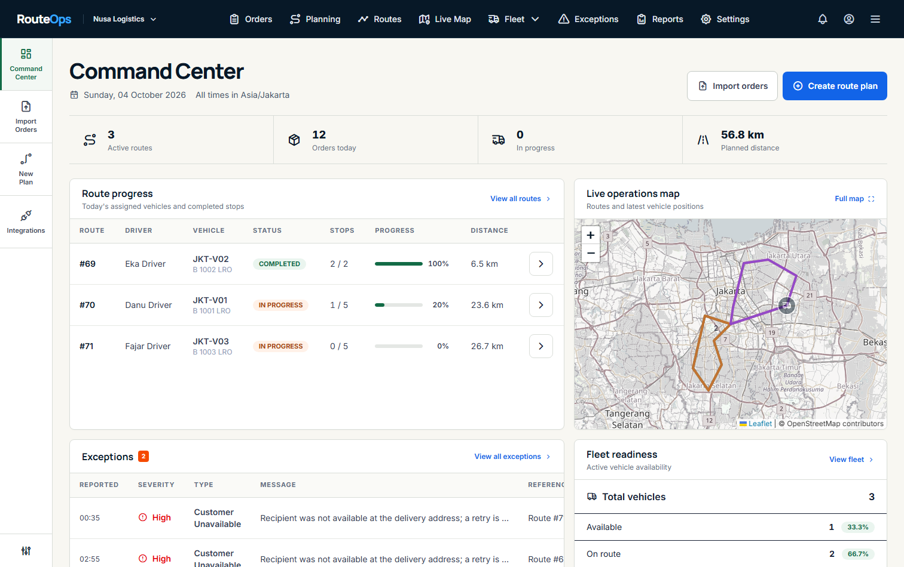
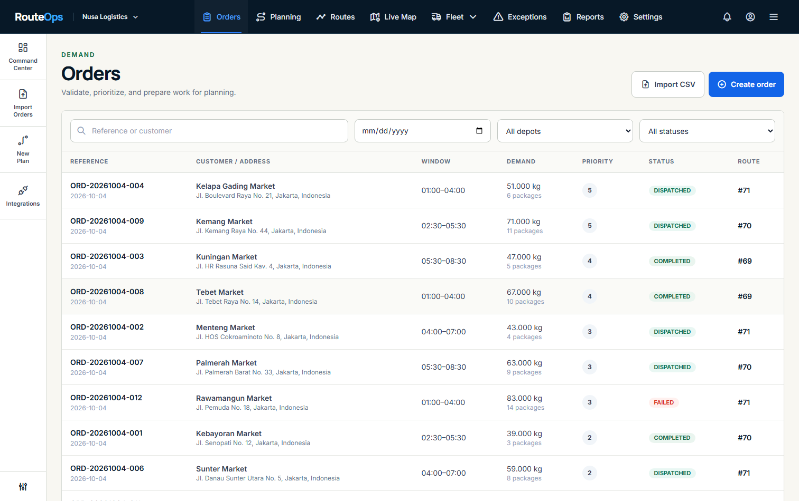
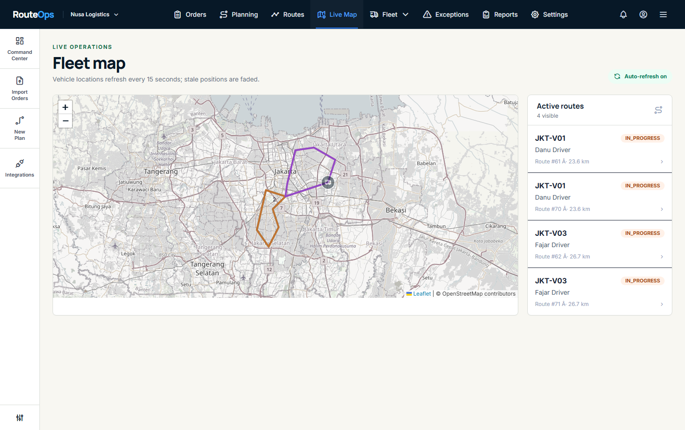
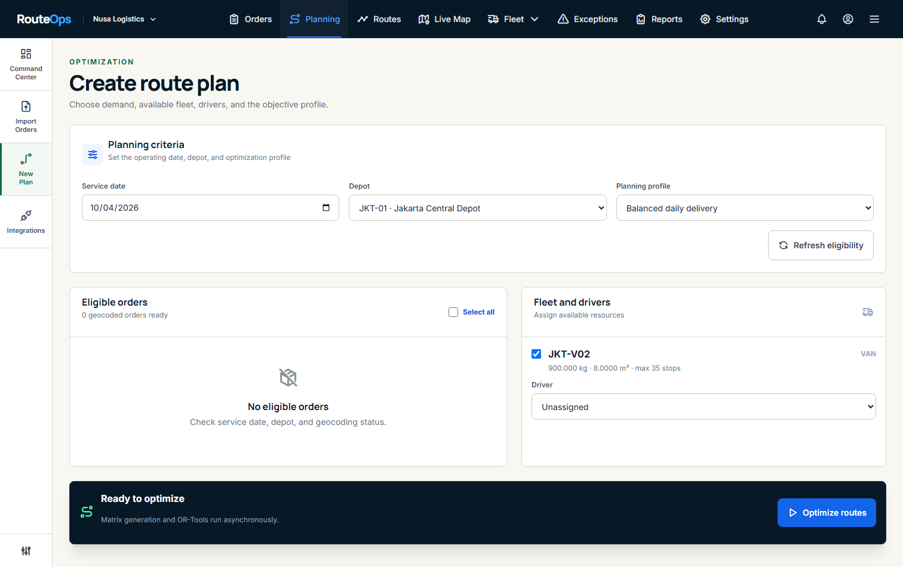
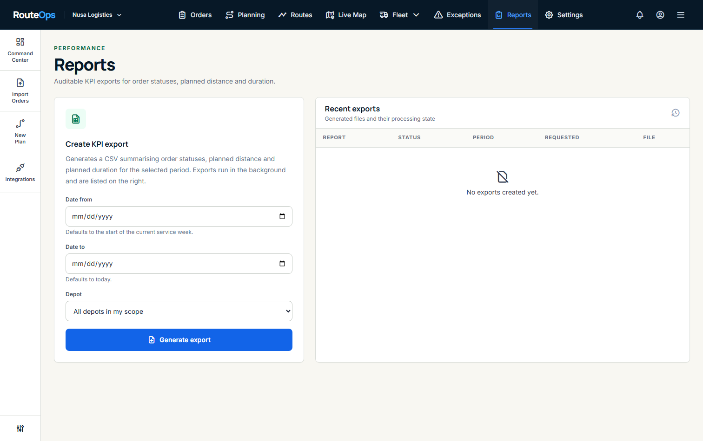
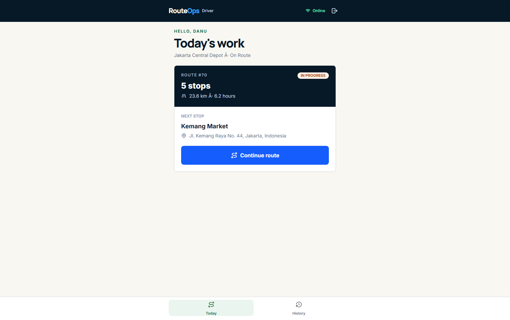
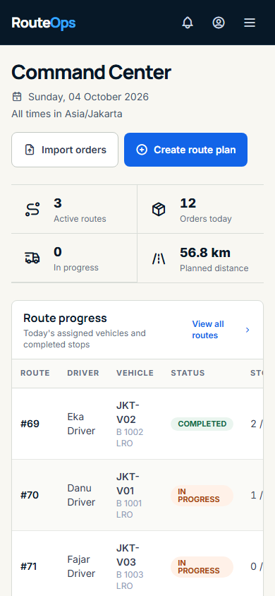

# RouteOps Logistics Route Optimization

A multi-tenant logistics platform covering order intake, constrained vehicle routing, dispatch,
driver execution, proof of delivery, live tracking, exception handling and reporting.

Built as a working operations system rather than a CRUD demo: the scheduling engine is a real
constrained VRPTW solver, every state change is version-checked and audited, and tenant isolation is
enforced in the queryset layer rather than in the templates.



## The problem it solves

Dispatching delivery orders is a constrained vehicle-routing problem, not a nearest-neighbour loop.
A real plan has to respect delivery time windows, vehicle capacity in both weight and volume,
driver skills, shift availability, depot geography and a service duration per stop — and it has to
respect all of them simultaneously. Then it has to survive contact with reality: a driver arrives
early, a delivery fails, a customer reschedules, and the plan has to record what happened without
losing the audit history of how it got there.

This project implements that whole arc — intake, solve, dispatch, execute, reconcile — with the
failure modes handled rather than assumed away.

## Features

| Area | What it does |
| --- | --- |
| Order intake | CSV import with per-row validation and rejection reporting, manual entry, address geocoding |
| Optimization | OR-Tools CVRPTW: time windows, weight and volume capacity, skills matching, multi-depot |
| Dispatch | Plan review, drag-and-drop reordering, validation gate, optimistic-concurrency dispatch |
| Driver execution | Today's route, arrive/complete/fail/skip, photo and signature capture, offline queue |
| Live tracking | Driver GPS ingest, Leaflet map with vehicle clustering, stale-position flagging |
| Exceptions | Automatic raise on failed stops, acknowledgement and resolution with recorded reasons |
| Reporting | KPI CSV export generated from the console, stored privately behind an authorized endpoint |
| Webhooks | HMAC-signed event delivery with retry, publish-on-commit |
| Audit | Every mutation records actor, before/after state, IP and request id |

## Stack

- Python 3.14, Django 5.2, GeoDjango, Django REST Framework, Celery
- PostgreSQL 15+ with PostGIS (SRID 4326 geometry columns, GiST-indexed)
- OR-Tools 9.15 for vehicle routing
- Jinja2, Tailwind CSS 4, HTMX, Alpine.js (CSP build), Leaflet, SortableJS, Chart.js
- Redis — **optional**; see [Running without Redis](#running-without-redis)
- pytest, Playwright, Ruff

## Architecture

```
apps/
  common/        shared models, scoping, API base classes, dispatch, events, state machine
  organizations/ tenants and memberships (depot scope lives here)
  accounts/      custom user model
  depots/        operating locations and restricted zones
  customers/     customers and addresses
  orders/        orders, items, time windows, CSV import
  fleet/         vehicles and availability
  drivers/       drivers, devices, shifts
  routing/       geocoding and travel-time matrix
  optimization/  OR-Tools model and solver
  planning/      planning runs, route plans, routes, stops, violations
  dispatch/      plan dispatch orchestration
  tracking/      driver events, location ingest
  proof_of_delivery/
  exceptions/    operational exception queue
  reports/       KPI export
  integrations/  webhooks and notifications
  audit/         append-only audit log
```

Four decisions are worth calling out, because they are where a system like this usually goes wrong:

**Organization resolution runs twice.** `CurrentOrganizationMiddleware` deliberately skips bearer
requests, because middleware runs before DRF has authenticated anyone. The view base class finishes
the job in `initial()`. Get this wrong and every token-authenticated endpoint answers 403 to the
very clients the token endpoint just authenticated.

**Scoping is fail-closed.** A membership with no depots assigned sees *nothing*. Returning "no
restriction" for an empty depot set would silently grant organization-wide access, which is the
opposite of the intended default.

**The transition table is the authority.** `apps/common/state_machine.py` holds every legal status
change and validates itself against the model `TextChoices` at import time. Adding a status to a
model without deciding where it goes fails immediately rather than producing an entity that can never
move.

**Redis is optional, everywhere.** Cache, task dispatch, progress streaming and the readiness probe
all degrade rather than fail. This is a tested property, not a claim: see
`tests/integration/test_audit_regressions.py`.

Full detail is in [`docs/architecture.md`](docs/architecture.md).

## Requirements

- Python 3.14
- Node.js 20 or newer
- PostgreSQL 15 or newer **with the PostGIS extension available**
- GDAL and GEOS native libraries

Any managed Postgres provider that offers PostGIS works (Neon, Supabase, RDS, Railway, Crunchy
Bridge). The application does not support MySQL: the schema stores geometry columns and relies on
PostGIS-specific behaviour. The original MySQL requirement and the reason for the migration are
recorded in [`PRD_06_Logistics_Route_Optimization.md`](PRD_06_Logistics_Route_Optimization.md).

On Debian/Ubuntu the native libraries come from the system packages:

    sudo apt-get install -y gdal-bin libgdal-dev binutils libproj-dev libgeos-dev

On Windows there is no system GDAL, so set `GDAL_LIBRARY_PATH` and `GEOS_LIBRARY_PATH` in `.env`.
The quickest source is the `rasterio` wheel's bundled DLLs:

    pip install rasterio
    python -c "import rasterio, pathlib; print(pathlib.Path(rasterio.__file__).parent / 'libs')"

Point each variable at the matching DLL in that directory (the filenames contain a content hash,
so list the folder to find them).

## Local setup

1. Create and activate a virtual environment, then install dependencies:

       python -m venv .venv
       .\.venv\Scripts\python.exe -m pip install -r requirements.txt -r requirements-dev.txt
       npm install

2. Copy `.env.example` to `.env` and fill it in. Set `DATABASE_URL` for a managed provider, or the
   individual `DATABASE_*` values for a local server. Enable PostGIS on the database once:

       CREATE EXTENSION IF NOT EXISTS postgis;

   Migrations try to create it automatically, but a role without superuser rights needs it done for
   them.

3. Build the frontend assets and prepare the database:

       npm run build
       .\.venv\Scripts\python.exe manage.py migrate
       .\.venv\Scripts\python.exe manage.py seed_demo
       .\.venv\Scripts\python.exe manage.py runserver

4. Open http://127.0.0.1:8000.

### Running without Redis

Redis is not required. With nothing listening:

- caching falls back to in-process memory (outside DEBUG) or stays local (in DEBUG)
- rate limiting degrades **open** — requests are allowed rather than rejected
- tasks run inline in the request via `CELERY_TASK_ALWAYS_EAGER=true`
- the optimization progress page falls back from SSE to polling
- `/health/ready/` returns `200` with `"degraded": ["broker"]`

To run the real worker and scheduler, start Redis and set `CELERY_TASK_ALWAYS_EAGER=false`:

    celery -A config worker -l info
    celery -A config beat -l info

## Demo accounts

All demo users share the password `demo123`:

| Email | Role |
| --- | --- |
| demo@example.com | Dispatcher — plans, reviews and dispatches routes |
| operations@example.com | Operations — live map, exceptions, reports |
| driver1@example.com, driver2@example.com, driver3@example.com | Drivers — field execution |
| admin@example.com | Administrator |

The login page shows these credentials **only when `DJANGO_DEBUG=true`**. In any deployed
environment the block is omitted, because `admin@example.com` is seeded with `is_staff=True` and
publishing it would hand over an administrator login.

`seed_demo` is idempotent: re-running it replaces the demo organization's planning history rather
than appending to it, so the dashboards never drift out of sync with the described scenario. It
anchors its service dates to **today**, so re-seed whenever the demo database has gone stale.

## Screenshots

Captured at desktop (1512×950) and mobile (390×844):

| | |
| --- | --- |
|  Orders |  Live map |
|  Planning run |  Reports |
|  Driver today |  Mobile |

Regenerate them against a running server:

    node scripts/capture-portfolio.cjs

## API

Interactive docs at `/api/docs/`, schema at `/api/schema/`.

Endpoints under `/api/v1` follow the resource-oriented REST convention rather than a wrapper
envelope, which keeps responses directly consumable by the browsable API, the OpenAPI schema and
HTTP caching:

- **Success** returns the serialized resource itself, with the appropriate status code (`200`,
  `201` with a `Location` header, or `204` with an empty body for deletions).
- **Failure** returns a consistent error document:

      {
        "code": "validation_error",
        "message": "Validation failed",
        "field_errors": {"external_ref": ["This field is required."]},
        "request_id": "3f9c1a..."
      }

- **List** endpoints are paginated:

      {
        "count": 248, "page": 1, "page_size": 50, "total_pages": 5,
        "next": "https://.../?page=2", "previous": null,
        "results": [ ... ]
      }

  `?page_size=` may raise the size up to a hard ceiling of 200. Querysets without a declared order
  are given a primary-key tie-break, because paginating an unordered queryset silently duplicates and
  drops rows between pages.

`request_id` matches the `X-Request-ID` response header and the server log entry, so a reported
failure can be traced straight to its request. Mutating endpoints that require an `Idempotency-Key`
header replay the stored response body verbatim on retry.

## Verification

    .\.venv\Scripts\python.exe manage.py check
    .\.venv\Scripts\python.exe manage.py check --deploy
    .\.venv\Scripts\python.exe manage.py makemigrations --check --dry-run
    .\.venv\Scripts\python.exe -m pytest tests -q
    .\.venv\Scripts\python.exe -m ruff check .
    npm run build
    npm run test:e2e

`check --deploy` should report exactly one warning: `SECURE_HSTS_PRELOAD` is unset, because
submitting a domain to the browser preload list is effectively irreversible and is a deliberate
decision rather than a default.

The test suite deliberately runs with `DJANGO_DEBUG=false` — the same posture as a deployment — so
the secure defaults are exercised on every run instead of only in production. `tests/conftest.py`
relaxes only `ALLOWED_HOSTS` and `SECURE_SSL_REDIRECT`, which describe the network rather than app
behaviour; HSTS, secure cookies and the CSP headers stay active under test.

A broad smoke test that renders **every named route** as a signed-in operator and reports any 5xx:

    .\.venv\Scripts\python.exe scripts/render_all_pages.py

Integration and browser suites need a migrated, seeded database. Fake routing and geocoding are the
defaults, so tests and the demo optimization run without internet access.

If a test run is interrupted against a **shared managed** Postgres, the `test_<name>` database
survives and every later run fails during setup with *"is being accessed by other users"*. Clear it
with:

    .\.venv\Scripts\python.exe manage.py reset_test_database

The browser suite needs a server running on `http://127.0.0.1:8000`:

    .\.venv\Scripts\python.exe manage.py runserver
    npm run test:e2e

It covers every operations surface (no console errors, no blank pages), the dispatcher and driver
journeys, and a responsive sweep at 1920, 1440, 1024, 768, 390 and 375 pixels that fails on any
horizontal overflow.

## Deployment

The production posture is **secure by default**: `DJANGO_DEBUG` defaults to `false`, and with DEBUG
off a missing or placeholder `DJANGO_SECRET_KEY` raises at startup rather than serving with a
publicly known signing key.

    pip install -r requirements.txt
    npm ci && npm run build
    python manage.py migrate
    python manage.py collectstatic --no-input
    gunicorn config.wsgi:application --bind 0.0.0.0:${PORT:-8000} --workers 3

Required environment variables:

| Variable | Notes |
| --- | --- |
| `DJANGO_SECRET_KEY` | Mandatory. No default outside DEBUG. |
| `DJANGO_DEBUG` | Must be explicitly `false`. |
| `ALLOWED_HOSTS` | Comma-separated; `testserver` is appended only under DEBUG. |
| `CSRF_TRUSTED_ORIGINS` | Required when serving over HTTPS. |
| `DATABASE_URL` | PostGIS connection string; takes precedence over `DATABASE_*`. |
| `FIELD_ENCRYPTION_KEY` | Strongly recommended. Rotating it or `DJANGO_SECRET_KEY` makes existing ciphertext unreadable — the field raises rather than returning a blank value. |

Endpoints for platform routing:

    GET /health/live/     liveness — always 200 while the process is up
    GET /health/ready/    readiness — 200 when the database answers; reports cache and broker as degraded
    GET /metrics/         Prometheus metrics

`SECURE_SSL_REDIRECT`, HSTS and secure cookies switch on automatically when DEBUG is off, so put a
TLS-terminating proxy in front of the app. `check --deploy` reports `SECURE_HSTS_PRELOAD` as unset;
enabling it is a deliberate, effectively irreversible decision and is therefore not a default.

Optional: `SENTRY_DSN` initialises error reporting (only when set, so a copied `.env` cannot ship
local stack traces elsewhere; request bodies are excluded because they carry customer PII).

## Environment

See [`.env.example`](.env.example) for the full annotated list. The values that most often need
attention:

- `DATABASE_URL` — connection string for a managed PostGIS database; takes precedence over the
  discrete `DATABASE_*` settings.
- `GDAL_LIBRARY_PATH`, `GEOS_LIBRARY_PATH` — Windows only; leave empty on Linux and macOS.
- `FIELD_ENCRYPTION_KEY` — encrypts customer and driver PII at rest. Generate a unique value for
  any non-demo data:

      python -c "from cryptography.fernet import Fernet; print(Fernet.generate_key().decode())"

- `GEOCODING_PROVIDER` / `ROUTING_PROVIDER` — switch from `fake` to `nominatim` / `osrm` to use
  live external services.
- `CELERY_TASK_ALWAYS_EAGER` — `true` unless a worker is running.
- `API_PAGE_SIZE` — default list page size; clients may request up to 200.

## License

Educational portfolio project.
